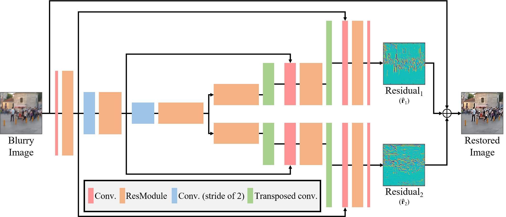

# XYDeblur: Offcial Pytorch Implementation

This repository provides the official PyTorch implementation of the following paper: [XYDeblur](https://openaccess.thecvf.com/content/CVPR2022/html/Ji_XYDeblur_Divide_and_Conquer_for_Single_Image_Deblurring_CVPR_2022_paper.html)



> XYDeblur: Divide and Conquer for Single Image Deblurring \
> Seowon Ji*, Jeongmin Lee*, Seung-Wook Kim*, Jun-Pyo Hong, Seung-Jin Baek, Seung-Won Jung, Sung-Jea Ko \
> In CVPR 2022. (* indicates equal contribution)
>
> Abstract: Many convolutional neural networks (CNNs) for single image deblurring employ a U-Net structure to estimate latent sharp images. Having long been proven to be effective in image restoration tasks, a single lane of encoder-decoder architecture overlooks the characteristic of deblurring, where a blurry image is generated from complicated blur kernels caused by tangled motions. Toward an effective network architecture, we present complemental sub-solutions learning with a one-encoder-two-decoder architecture for single image deblurring. Observing that multiple decoders successfully learn to decompose information in the encoded features into directional components, we further improve both the network efficiency and the deblurring performance by rotating and sharing kernels exploited in the decoders, which prevents the decoders from separating unnecessary components such as color shift. As a result, our proposed network shows superior results as compared to U-Net while preserving the network parameters, and the use of the proposed network as the base network can improve the performance of existing state-of-the-art deblurring networks.

---

## Test
- To test XYDeblur, run the command below:
```python
python main.py --mode "test"
```

- Resultant data including result image, $\hat{\mathbf{r}}_1$, and $\hat{\mathbf{r}}_2$ will be saved in the following directory: \
`results/XYDeblur/eval`

- For $\hat{\mathbf{r}}_1$ and $\hat{\mathbf{r}}_2$, two types of files will be stored ($\ast$.png and $\ast$.mat). \
The first $\ast$.png file contains the normalized data in the range of [0,255]. \
The second $\ast$.mat file contains the original tensor data.

## Training
- To train XYDeblur, run the command below:
```python
python main.py --mode "train"
```

- During the training process, the training log and intermediate weights will be stored in the following directories: \
`runs/XYDeblur` \
`results/XYDeblur/weights`

- Since we only provide a sample training dataset, whole blur and sharp images should be copied to the following directories to further train the network with entire training dataset: \
`sample/data/train/blur` \
`sample/data/train/sharp`

## Experimental Results

Experimental results for [MSCNN](https://openaccess.thecvf.com/content_cvpr_2017/html/Nah_Deep_Multi-Scale_Convolutional_CVPR_2017_paper.html), [DMPHN](https://openaccess.thecvf.com/content_CVPR_2019/html/Zhang_Deep_Stacked_Hierarchical_Multi-Patch_Network_for_Image_Deblurring_CVPR_2019_paper.html), [PSS-NSC](https://openaccess.thecvf.com/content_CVPR_2019/html/Gao_Dynamic_Scene_Deblurring_With_Parameter_Selective_Sharing_and_Nested_Skip_CVPR_2019_paper.html) with and without our approach from the GoPro dataset.


